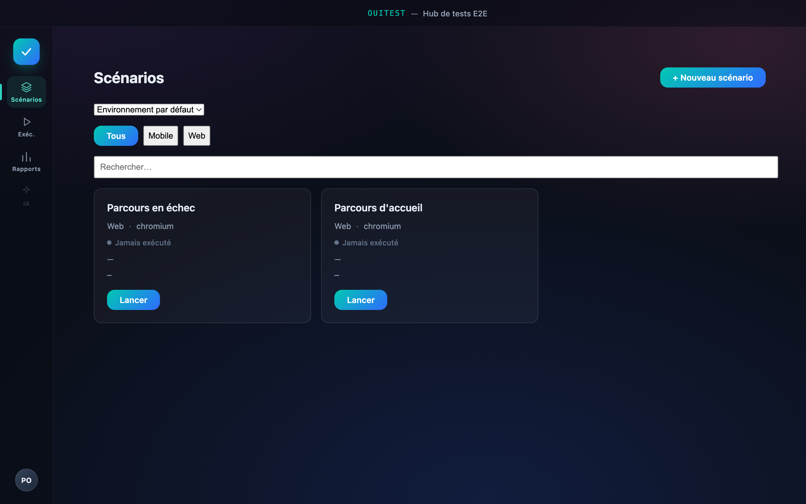
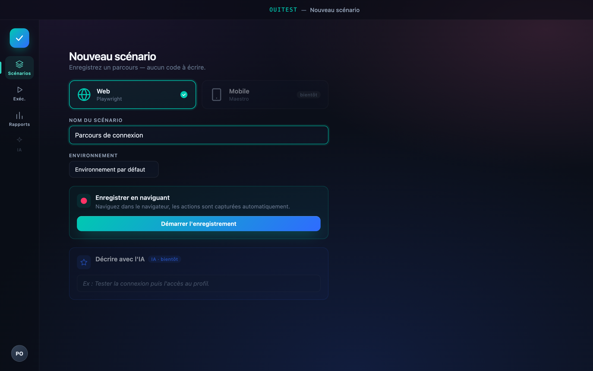
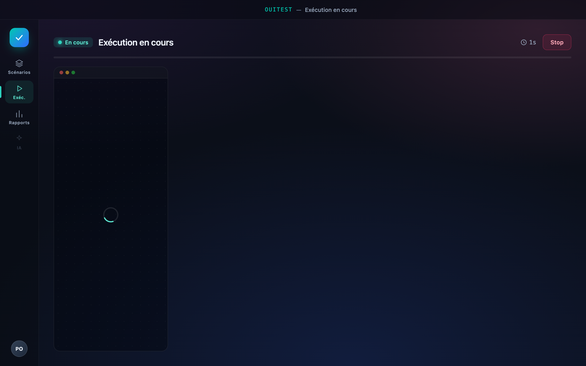
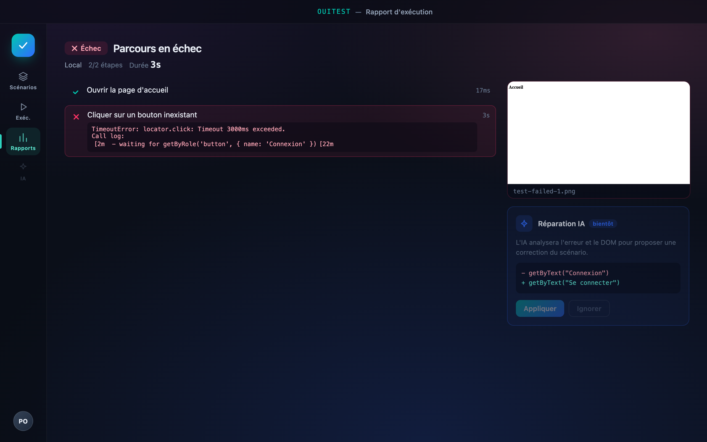

# Ouigo Test Lab

> Application desktop premium pour créer, lancer et analyser des tests E2E (Playwright Web) sans écrire de code — pensée pour des testeurs non techniciens. Teste les parcours de réservation OUIGO.



## Présentation

Ouigo Test Lab permet de **construire, exécuter et auditer des tests de bout en bout** sur les parcours de réservation OUIGO, sans toucher à une seule ligne de code. On enregistre un parcours par simples clics, l'application le rejoue dans un vrai navigateur via Playwright, et restitue un rapport clair — capture à l'appui en cas d'échec.

## Fonctionnalités principales

- **Projets + Environnements** — organisez vos tests par projet et basculez entre URLs de préprod, recette ou staging propres à chaque environnement.
- **Scénarios groupés par tunnel** — vue d'ensemble avec filtres et bilans pour suivre l'état de chaque parcours.
- **Enregistrement par clic** — capture du parcours via le codegen Playwright : aucun code à écrire.
- **Validation automatique au premier lancement** — auto-run du scénario dès sa création pour confirmer qu'il passe.
- **Exécution en direct (Live Run)** — suivez les étapes en temps réel pendant que le test se déroule.
- **Rapport d'exécution** — résultat détaillé avec capture d'écran prise au moment exact de l'échec.
- **Gestion des étapes par mode** (visible / invisible) avec brouillon « Relancer / Enregistrer » pour ajuster un parcours sans le casser.
- **Lancer un scénario N fois** (séquentiel ou parallèle) pour valider KPI et trackings sous charge répétée.
- **Design sombre glassmorphique** — interface premium avec dégradé cyan → bleu.

## Captures

### Création d'un scénario



Définissez un nouveau scénario et lancez l'enregistrement par clic — l'application capture chaque interaction.

### Exécution en cours



Le Live Run affiche les étapes au fil de l'eau pendant que Playwright rejoue le parcours dans le navigateur.

### Rapport d'exécution



Chaque exécution produit un rapport détaillé, avec une capture d'écran prise au moment précis de l'échec.

## Stack technique

- **Electron + React + TypeScript** (electron-vite) — application desktop.
- **Playwright** — enregistrement (codegen) et exécution des tests E2E.
- **Vitest + Testing Library** — tests unitaires.
- **Biome** — lint et formatage.
- **Plateformes** : macOS et Windows.

## Démarrage rapide

```bash
# Installation des dépendances
npm install

# Lancement en mode développement
npm run dev

# Build de l'application
npm run build

# Tests unitaires
npm run test

# Tests E2E (Playwright)
npm run test:e2e

# Lint (Biome)
npm run lint
```

## Structure du projet

- **`src/main`** — processus principal Electron : enregistreur (codegen), runner Playwright, stores et IPC.
- **`src/preload`** — pont sécurisé exposant l'API au renderer.
- **`src/renderer`** — interface React (écrans, composants, store, thème).
- **`src/shared`** — types et logique partagés entre le main et le renderer.
